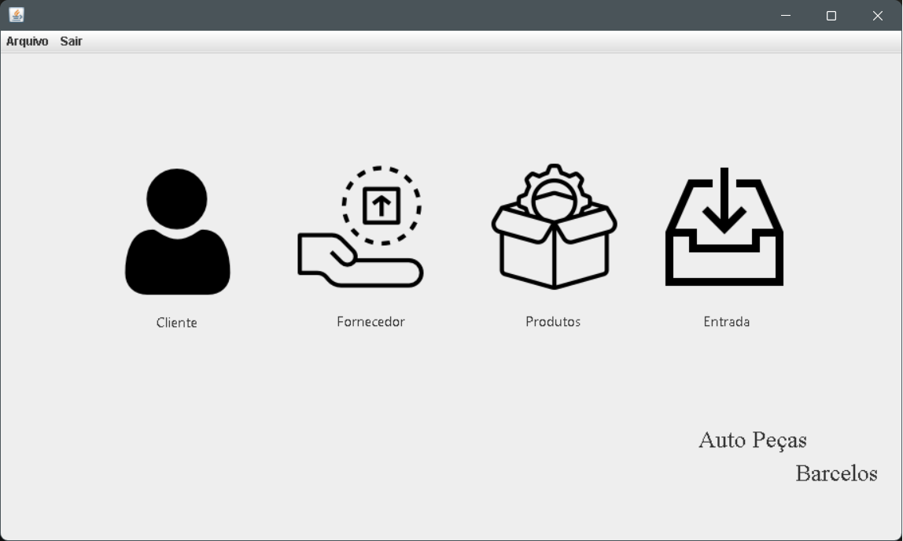

# Aplicação Java para a gestão de empresas do seguimento de peças automotivas 

## Sobre 

A aplicação faz parte do planejamento da disciplina ***Projeto de Sistemas de Informação*** presente no 6º período do curso de Sistemas de Informação da **Universidade do Estado de Minas Gerais - UEMG FRUTAL**.

O objetivo da aplicação é de realizar toda a gestão de uma empresa do setor de auto peças, gerenciando seus clientes, fornecedores, estoque, entradas e saídas de produtos. 

O desenvolvimento do projeto ocorre seguindo as boas práticas da metodologia ***Scrum*** visando a cada Sprint apresentar uma nova área do sistema, além de rotacionar as responsabilidades de cada integrante do time ágil.  

 
<h2>Atual tela principal do sistema</h2>

  

 

## Devs 

* [Danielle Oliveira](https://github.com/Dani-oliiv)
* [Kaynnan Lemes](https://github.com/kaynnan)
* [Luiz Martins](https://github.com/luixmartins)
* [Rodrigo Neves](https://github.com/rodrigonevest)

